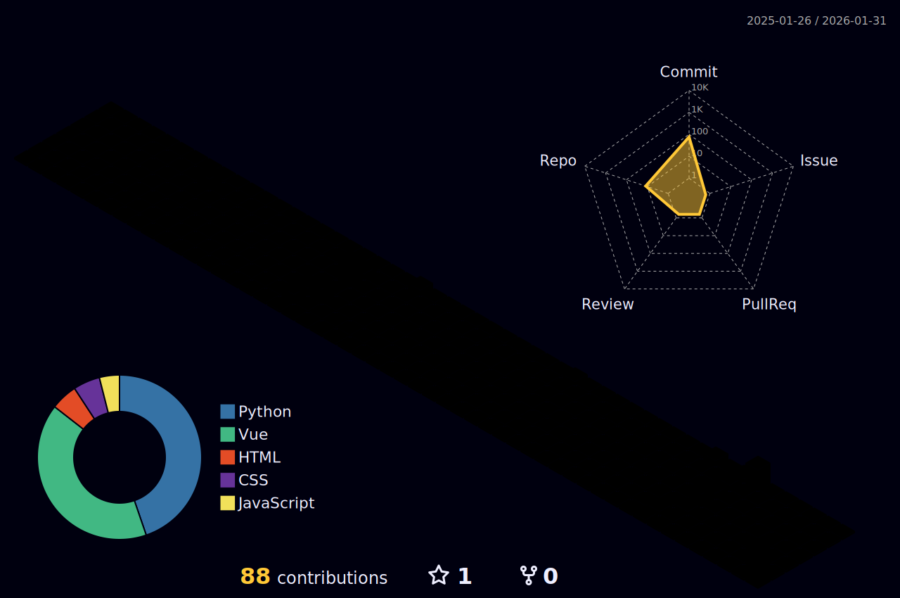

<h1 align="center">
  
</h1>

<h3 align="center">🐶 Pet lover | 💻 Developer | 🇹🇼 From Taiwan</h3>
<h3 align="center">🧑‍💻 About Me</h3>
<h5 align="center">✨ Someone who's moving forward toward their dreams. ✨</h5>

  

## 🏆 Achievements

  

## 📊 GitHub Stats

  
   
  
   
  

## 🔗 Links
- 🌐 [My Website](https://perpetsstore.com)
- ✏️ [Codepen](https://codepen.io/Mike-YC)
- 📫 [G-Mail](https://mail.google.com/mail/u/0/?tab=rm&ogbl#inbox?compose=CllgCJfqchVCtlXszrxJmZqQkbDsHJZXJlsjtqNkFPNPLHfGDmsgcQgppkCjPQllWWJzMBpwKwL)

## 🪄 My Skills

  

## 🐍 Contribution Snake

  <picture>
    <source media="(prefers-color-scheme: dark)" srcset="https://raw.githubusercontent.com/MikeYC-Wang/MikeYC-Wang/output/github-contribution-grid-snake-dark.svg">
    <source media="(prefers-color-scheme: light)" srcset="https://raw.githubusercontent.com/MikeYC-Wang/MikeYC-Wang/output/github-contribution-grid-snake.svg">
    
  </picture>

## 🏗️ My Coding City</h2>

  

