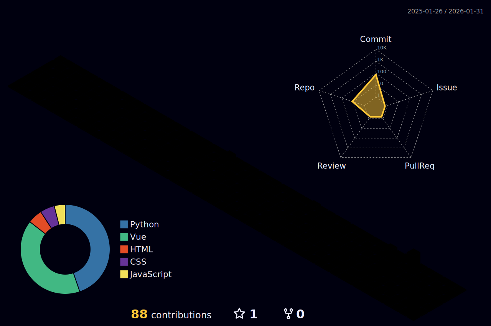

<h1 align="center">
  
</h1>

<h3 align="center">🐶 Pet lover | 💻 Developer | 🇹🇼 From Taiwan</h3>
<h3 align="center">🧑‍💻 About Me</h3>
<h5 align="center">✨ Someone who's moving forward toward their dreams. ✨</h5>

  

  

  

 

  

   

  

## 📊 GitHub Stats

 

 

## 🔗 Links
- 🌐 [My Website](https://mikeyc-wang.github.io/MyPortfolio/)
- 🐶 [My Ecommerce](https://perpetsstore.co/)
- 🍱 [Food Roulette](https://food-roulette-ruby.vercel.app/)
- ✏️ [Codepen](https://codepen.io/Mike-YC)
- 📫 [G-Mail](https://mail.google.com/mail/u/0/?tab=rm&ogbl#inbox?compose=CllgCJfqchVCtlXszrxJmZqQkbDsHJZXJlsjtqNkFPNPLHfGDmsgcQgppkCjPQllWWJzMBpwKwL)

## 🪄 My Skills

  

## 🐍 Contribution Snake

  

## 🏗️ My Coding City

  
  

  
  
  
  
  
  
  

